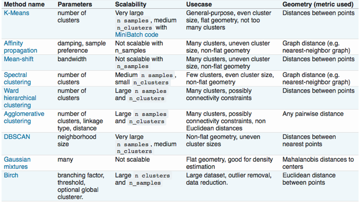
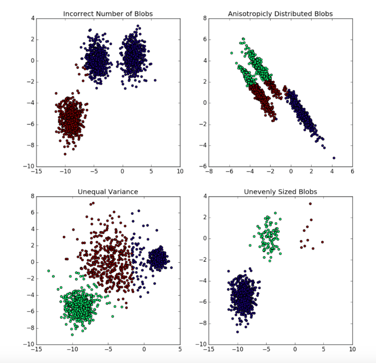

```{r setup, include=FALSE}
knitr::opts_chunk$set(echo = FALSE,warning=FALSE,message=FALSE)
```

```{r load data, results='hide'}
les_packages = lapply(c("quantmod","DMwR","gridExtra","ggthemes","ggplot2","ROSE","caret","DT",
                       "viridis","wordcloud","corrplot","visNetwork","data.table","dplyr"),
                      require, character.only = TRUE)
## load files
input_path = '../files/'
```

# Executive Summary

This is intended to be a handy cheatsheet for a data scientist from end to end.

# Data Manipulation

For most used data manipulation techniques in R, Python, and Hive, see `data_manipulation_dict.xlsx`.

# Visualization

Here are the most commonly used visualizations:

## Barchart

```{r}
position = readRDS(paste0(input_path,'position.rds'))
g = ggplot(position, aes(x=position_flag,y=value,fill=before_after)) + 
  geom_bar(stat='identity',position='dodge') +
  facet_wrap(~country+os_name,scales = 'free_y') + theme_fivethirtyeight() + scale_fill_wsj() +
  scale_y_continuous(labels=scales::percent) + geom_hline(yintercept = 0.4, color='grey') +
  theme(legend.title = element_blank())
g
```

## Histogram

```{r,fig.width=10,fig.height=10}
sustain <- read.csv(paste0(input_path,'sustain8.csv')) %>% filter(!is.na(ID))
#descriptive statistics
descript <- sustain[,c(28:53)]

descript$id_var <- 1
descript_m <- melt(descript,id='id_var')
descript_m <- subset(descript_m,select=-c(id_var))
descript_m$value <- as.numeric(descript_m$value )

g<-ggplot(descript_m,aes(x=value)) + geom_histogram() + 
  facet_wrap(~variable,scales=c('free'),ncol=5) + theme_fivethirtyeight()
g
```

## Scatterplot

```{r}
g = ggplot(iris, aes(x=Sepal.Length,y=Sepal.Width,color=Species)) + geom_point(size = 2) +
  theme_fivethirtyeight() + scale_color_wsj(name='Legend') + ggtitle("Sepal Length vs Sepal Width")
g
```

## Line

```{r}
getSymbols.google('GOOG',env = globalenv())
goog = data.frame(GOOG)[1:50,]
goog$created_at = rownames(goog)
goog$change = c(0,diff(log(goog$GOOG.Close)))
g = ggplot(goog,aes(x=created_at,y=change,group = 1)) + geom_point(size =0.01) + geom_line() +
  theme_fivethirtyeight() + scale_y_continuous(labels = scales::percent) +
  geom_smooth(method='loess')+
  theme(axis.text.x = element_blank()) + ggtitle('Google Stock Price over Time')
g
```

## Boxplot

Lines mean
- Q1 - 1.5 * IQR
- Q1
- Median
- Q3
- Q3 + 1.5 * IQR

```{r}
g= ggplot(mpg, aes(x=class, y=hwy, fill=class)) + geom_boxplot() +
  theme_fivethirtyeight() + scale_fill_wsj()
g
```

## Heatmap

```{r}
cor_at = melt(cor(attitude))
g = ggplot(cor_at,aes(x=Var1,y=Var2,fill=value)) + geom_tile() +
  theme_fivethirtyeight() 
g
```

## Graph

```{r}
nodes = data.frame(id = 1:10, color = c(rep("blue", 6), rep("red", 3), rep("green", 1))) 
nodes$group = nodes$color
nodes$label = nodes$color
edges <- data.frame(from = round(runif(6)*10), to = round(runif(6)*10))
visNetwork(nodes, edges) %>%
  visOptions(highlightNearest = TRUE, nodesIdSelection = FALSE) %>% 
    visPhysics(solver = "forceAtlas2Based", 
               forceAtlas2Based = list(gravitationalConstant = -500),
               maxVelocity=0) %>%
    visInteraction(navigationButtons = TRUE) %>% 
    visLegend(useGroups=FALSE,addNodes=nodes) %>%
    visOptions(selectedBy=list(variable="group"))
```


## Confidence Interval

```{r}
multiplot <- function(..., plotlist=NULL, file, cols=1, layout=NULL) {
  library(grid)
  
  # Make a list from the ... arguments and plotlist
  plots <- c(list(...), plotlist)
  
  numPlots = length(plots)
  
  # If layout is NULL, then use 'cols' to determine layout
  if (is.null(layout)) {
    # Make the panel
    # ncol: Number of columns of plots
    # nrow: Number of rows needed, calculated from # of cols
    layout <- matrix(seq(1, cols * ceiling(numPlots/cols)),
                     ncol = cols, nrow = ceiling(numPlots/cols))
  }
  
  if (numPlots==1) {
    print(plots[[1]])
    
  } else {
    # Set up the page
    grid.newpage()
    pushViewport(viewport(layout = grid.layout(nrow(layout), ncol(layout))))
    
    # Make each plot, in the correct location
    for (i in 1:numPlots) {
      # Get the i,j matrix positions of the regions that contain this subplot
      matchidx <- as.data.frame(which(layout == i, arr.ind = TRUE))
      
      print(plots[[i]], vp = viewport(layout.pos.row = matchidx$row,
                                      layout.pos.col = matchidx$col))
    }
  }
}

#linear regression result
lin_result <- read.csv(paste0(input_path,'lin_result.csv'))
training <- read.csv(paste0(input_path,'training.csv'))
testing <- read.csv(paste0(input_path,'testing.csv'))

target <- c(0.034,0.05,0.059)
percent_limit <- c(1,0.75,0.25,0.05)

error_line <- function(var,x_name,percent_limit){
  fol <- as.formula(paste0('per_nc~',var))
  fit <- train(fol, data= training[,-c(1:4)], method='lm')
  df <- data.frame(variable=seq(0,1,by=0.001))
  df$nc <- fit$finalModel$coefficients[1] + 
    fit$finalModel$coefficients[2]*df$variable
  df_solve <- data.frame(target = target)
  df_solve$variable <- (df_solve$target + (-1 * fit$finalModel$coefficients[1])) / 
    fit$finalModel$coefficients[2]
  
  pred<-predict(fit,testing)
  error_df <- data.frame(pred=pred,real=testing$per_nc)
  RMSE <- mean(abs(error_df$real - error_df$pred))
  RMSE_per <- mean(abs(error_df$real - error_df$pred)/error_df$pred)
  
  g <- ggplot(data=df, aes(x=variable, y=nc)) + geom_line(color='orange') +
    scale_y_continuous(labels = scales::percent,limits = c(0,0.1)) + 
    xlab(paste0(x_name,' (error=',round(RMSE_per*100,2),'%) ')) +
    scale_x_continuous(labels = scales::percent, limits=c(0,percent_limit)) + 
    ylab('Acquisition Rate') +
    geom_point(data=testing,aes(x=eval(parse(text=var)),y=per_nc),size=1) +
    geom_line(data=df, aes(x=variable, y=nc+RMSE),linetype ="dashed",color='orange',alpha=0.5) +
    geom_line(data=df, aes(x=variable, y=nc-RMSE),linetype ="dashed",color='orange',alpha=0.5) 
  g
}

list_variables1 <- c('per_fb_search',
                     'per_fb_view_product','per_add_to_cart','per_guest_sale')
list_variables2 <- c('Search',
                     'View Product','Add to Cart','Guest Sale')

list_g <- list()
for (i in 1:length(list_variables1)){
  var <- list_variables1[i]
  x_name <- list_variables2[i]
  list_g[[i]] <- error_line(var,x_name,percent_limit[i])
}

#prediction vs real
fol <- per_nc~per_fb_view_listing+per_fb_view_product+per_sale+per_guest_sale+network+ostype
fit <- train(fol, data= training, method='lm')
pred <- predict(fit, testing)
result <- data.frame(per_nc=testing$per_nc,pred=pred)

RMSE <- mean(abs(result$per_nc - result$pred))
RMSE_per <- mean(abs(result$per_nc - result$pred)/result$pred)

g <- ggplot(data=result, aes(x=pred, y=pred)) + geom_line(color='orange') +
  scale_y_continuous(labels = scales::percent,
                     limits = c(0,0.1)) + 
  xlab(paste0('Model',' (error=',round(RMSE_per*100,2),'%) ')) +
  scale_x_continuous(labels = scales::percent,
                     limits = c(0,0.09)) + ylab('Acquisition Rate') +
  geom_point(data=testing,aes(x=pred,y=per_nc),size=1) +
  geom_line(data=result, aes(x=pred, y=pred+RMSE),
            linetype ="dashed",color='orange',alpha=0.5) +
  geom_line(data=result, aes(x=pred, y=pred-RMSE),
            linetype ="dashed",color='orange',alpha=0.5) 
list_g[[1]] <-g

multiplot(cols=2,plotlist = list_g)
```


## Rank

```{r}
lin_result_m <- melt(lin_result[c('network','rank_real','rank_predicted')])

g20 <-ggplot(data=lin_result_m, aes(x=variable, y=value, group= network, colour=network)) +
  geom_point(size=3, fill="white") + xlab('Events') + ylab('Rank')+
    scale_color_viridis(discrete = TRUE) +
  geom_line() + scale_y_continuous(breaks=seq(1,12,by=1)) +
  scale_x_discrete(labels=as_labeller(c(
    "rank_real" = "Real Rank",
    "rank_predicted" = "Predicted Rank"
  ))) + theme(legend.key.size =  unit(0.5, "cm"),
      panel.grid.major = element_blank(), panel.grid.minor = element_blank(),
      panel.background = element_rect(fill = "white")) 
g20
```

## Correlogram

```{r, fig.width=10, fig.height=10}
M <- cor(descript %>% dplyr::select(-id_var))
corrplot(M,order="AOE",type="upper",tl.pos="tp")
corrplot(M,add=TRUE, type="lower", method="number",order="AOE", col="black", number.cex = 0.8, diag=FALSE,tl.pos="n", tl.cex=0.6,cl.pos="n",addCoefasPercent=TRUE)
```

## Word Cloud

```{r}
pal <- brewer.pal(9,"BuGn")
wordcloud(words=c(letters, LETTERS, 0:9), freq=seq(1, 1000, len = 62),
          colors=pal)
```


## Datatable

### Compact

```{r}
datatable(position %>% select(country,os_name,before_after,position_flag,value),
          colnames = c('Country' = 1,
            'OS' = 2 ,
            'Before/After Flag' = 3,
            'Position' = 4,
            '% Session' =5
            ),
           class = 'cell-border stripe',
           rownames = FALSE,
          options = list(dom='t')
           ) %>%
  formatPercentage('% Session',2) %>%
  formatStyle(
  '% Session',
  color = 'white',
  fontWeight = 'bold' ,
  backgroundColor = styleInterval(c(0.5), c('#ff6666', '#33cc33'))
  ) 
  #%>%
  #formatRound() %>%
  #formatCurrency()
```

### Full Option

```{r}
datatable(position %>% select(country,os_name,before_after,position_flag,value),
          filter='top',
          colnames = c('Country' = 1,
            'OS' = 2 ,
            'Before/After Flag' = 3,
            'Position' = 4,
            '% Session' =5
            ),
           class = 'cell-border stripe',
           rownames = FALSE,
           options = list(pageLength=15)
           ) %>%
  formatPercentage('% Session',2)
```

# Statistical Inference

## Probability

For an event A where $P(A) \in [0,1]$,

$$P'(A) = 1 - P(A)$$
$$P(A \cup B) = P(A) + P(B) - P(A \cap B)$$
$$P(A|B) = \frac{P(A \cap B)}{P(B)} = \frac{P(B|A)P(A)}{P(B)}$$
$$P(A \cap B) = P(B|A)P(A) $$

## Type I Error, Type II Error, Significance, Power and Cohen's d
* Type I - false **P**(one vertical line)ositive (alpha, significance)
* Type II - false **N**(two vertical lines)egative (beta)
* Power - chance of rejecting null hypothesis when null hypothesis is false (1-beta)
* Cohen's d - effect size (0.2, 0,5, 0.8 but need to read more)

## Evaluation Metrics

* Precision, positive predictive value - $\frac{TP}{TP+FP}$
* Recall, sensitivity, true positive rate - $\frac{TP}{TP+FN}$
* Specificity, true negative rate - $\frac{TN}{TN+FP}$
* False discovery rate - 1 - precision - $\frac{FP}{FP+TP}$
* Accuracy - $\frac{TP + TN}{ALL}$
* F1 - harmonic mean of precision and recall - $\frac{2TP}{2TP+FP+FN}$
  $ HarmonicMean = (\frac{\Sigma x^{-1}}{n})^{-1} $
* ROC - plot false positive rate (1-specificity) and true positive rate (sensitivity)
* Kappa - accuracy normalized by class imbalance $\frac{p_o-p_e}{1-p_e}$
* RMSE (l2) - $\sqrt{\frac{(predicted-actual)^2}{N}}$; penalizes extreme values
* MAE/MAPE (l1) - mean absolute error/mean absolute percentage error

## Central Tendencies

* Population mean - $\mu = \frac{1}{N} * \sum{X}$

* Sample mean - $\bar{x} = \frac{1}{n} * \sum{x}$

* Population variance - $\sigma^2 = \frac{1}{N} * \sum{(X-\mu)^2}$

* Sample variance - $s^2 = \frac{1}{n-1} * \sum{(x-\bar{x})^2}$

* Standard error of the means - $SEM = s/\sqrt{n}$

* Confidence interval - a range that, with repeated iterations, some percentage of sample values go in. $\bar{x} \pm t*SEM$

* Degree of freedom - number of values in a calculation that is free to vary. All independent variables less the number of intermediate paramenters.

## Dependence, Covariance and Correlation

* Variance - has units

$$Var(x) = E[(x-E[x])^2]$$

* Covariance

$$cov(X,Y) = E[(x-E(x))(y-E(y))]$$

* Correlation - scale from -1 to 1

$$corr(x,y) = \frac{cov(X,Y)}{\sigma_x * \sigma_y}$$

## Distributions

Oftentimes with big data, we rely on the assumption that the data will approximate to a normal distribution. However, it helps to understand what distributions are meant for what types of data since some data such as number of purchases per customer clearly do not approximate in such manner.

### Normal Distribution

* Variable - continuous
* Mean - $\mu$
* SD -  $\sigma$
* Standard normal distribution Z(0,1)

```{r}
x <- seq(-4, 4, length=100)
hx <- dnorm(x)
plot(x,hx,type='l')
```

### Chi-square Distribution

* Sum of squared standard normal variables
* Variable - continuous but used to test categorical also
* Mean - k
* SD -  $\sqrt{2k}$

```{r}
x <- seq(0, 10, length=100)
df <- c(1, 3, 8, 30)
colors <- c("red", "blue", "darkgreen", "gold", "black")
hx <- dchisq(x,1)
plot(x,hx,type='l')
for (i in 1:4){
    lines(x,dchisq(x,df[i]),col=colors[i])
}
```

### Student's t Distribution

* fatter tail normal distribution
* Variable - continuous but used to test categorical also
* Mean - 0
* SD -  $\frac{df}{df-2}$

```{r}
x <- seq(-4, 4, length=100)
df <- c(1, 3, 8, 30)
colors <- c("red", "blue", "darkgreen", "gold", "black")
hx <- dt(x,1)
plot(x,hx,type='l')
for (i in 1:4){
    lines(x,dt(x,df[i]),col=colors[i])
}
```

### F Distribution

* $\frac{X^2_{d1}/d1}{X^2_{d2}/d2}$
* Variable - continuous but used to test categorical also
* Mean - d2/(d2-2)
* SD -  $\sqrt{\frac{2d2^2(d1+d2-2)}{d1(d2-2)^2(d2-4)}}$

```{r}
x <- seq(0, 10, length=100)
df1 <- c(1, 3, 8, 30)
df2 <- c(3, 3, 3, 3)
colors <- c("red", "blue", "darkgreen", "gold", "black")
hx <- df(x,1,1)
plot(x,hx,type='l')
for (i in 1:4){
    lines(x,df(x,df1[i],df2[i]),col=colors[i])
}
```

### Bernoulli and Binomial Distribution

* Binomial is getting successes with probability p of n Bernoulli experiments
* $(n k) * p^k * (1-p)^(n-k)$
* Variable - discrete often used with proportions
* Mean - np
* SD -  $\sqrt{np(1-p)}$

```{r}
x <- seq(0, 100)
size <- c(50, 50, 100, 100)
prob <- c(0.1,0.3,0.5,0.8)
colors <- c("red", "blue", "darkgreen", "gold", "black")
hx <- dbinom(x,size=50,prob=0.1)
plot(x,hx,type='l')
for (i in 1:4){
    lines(x,dbinom(x,size=size[i],prob=prob[i]),col=colors[i])
}
```

### Poisson Distribution

* Number of indepedent, constant-rate events in an interval
* $\frac{\lambda^k * e^{-\lambda}}{k!}$
* Variable - discrete 
* Mean - $\lambda$
* SD -  $\sqrt{\lambda}$

```{r}
x <- seq(0, 100)
lamb <- c(1,4,10,50)
colors <- c("red", "blue", "darkgreen", "gold", "black")
hx <- dpois(x,1)
plot(x,hx,type='l')
for (i in 1:4){
    lines(x,dpois(x,lamb[i]),col=colors[i])
}
```

### Exponential Distribution

* Time between poisson process
* $\lambda * e^{-\lambda x}$
* Variable - continuous
* Mean - $\frac{1}{\lambda}$
* SD -  $\frac{1}{\lambda}$

```{r}
x <- seq(0, 100)
lamb <- c(0.1,0.3,0.5,1)
colors <- c("red", "blue", "darkgreen", "gold", "black")
hx <- dexp(x,1)
plot(x,hx,type='l')
for (i in 1:4){
    lines(x,dexp(x,lamb[i]),col=colors[i])
}
```


## Law of Large Numbers

When the number of samples/trials is large enough, the sample mean approaches the population mean. For example, in a series of dice rolls:

```{r}
set.seed(1412)
mean_pop = sum(1:6)/6
sample_df = data.frame(nb_sample=1:1000)
sample_df$sample_mean = sapply(sample_df$nb_sample,FUN=function(x) mean(sample(1:6,x,replace=TRUE)))
ggplot(sample_df,aes(x=nb_sample,y=sample_mean)) + geom_point(size=0.5) + geom_line() +
  geom_hline(yintercept = mean_pop,color='red') + 
  ggtitle('Sample Mean by # Samples') +
  theme_fivethirtyeight()
```

## Central Limit Theorem

The sample means of independent and identically distributed samples of any distribution with mean and variance will converge to a normal distribution when the number of samples increases.

```{r}
r = 10000 #no of sample means
n = 20 #no of samples when it's enough
n2= 2 #no of samples when it's NOT enough
sample.means <- function(samps, r, n) {
  rowMeans(matrix(samps,nrow=r,ncol=n))
}

qqplot.data <- function (vec) {
  # following four lines from base R's qqline()
  y = quantile(vec[!is.na(vec)], c(0.25, 0.75))
  x = qnorm(c(0.25, 0.75))
  slope = diff(y)/diff(x)
  int = y[1L] - slope * x[1L]

  d = data.frame(resids = vec)

  ggplot(d, aes(sample = resids)) + stat_qq() + 
  geom_abline(slope = slope, intercept = int, colour="red") + ggtitle("Q-Q plot")  +
  theme_fivethirtyeight()
}

generate.plots <- function(samps) {
  samp.means = sample.means(samps, r, n)
  samp.means2 = sample.means(samps, r, n2)
  p1 = ggplot(data.frame(x=samps),aes(x=x)) + geom_histogram(bins=30) +  
    ggtitle("Sample Histogram") + theme_fivethirtyeight()
  p2 = ggplot(data.frame(x=samp.means),aes(x=x)) + geom_histogram(bins=30) +
    ggtitle("Sample Mean n=200") + theme_fivethirtyeight()
  p3 = qqplot.data(samp.means)
  p4 = ggplot(data.frame(x=samp.means2),aes(x=x)) + geom_histogram(bins=30) +
    ggtitle("Sample Mean n=2") + theme_fivethirtyeight()
  grid.arrange(p1,p2,p3,p4,ncol=2)
}

#uniform
print('Uniform Distribution')
uni_pop = runif(r*n)
generate.plots(uni_pop)

#poisson
print('Poisson Distribution')
poi_pop = rpois(r*n,lambda=3)
generate.plots(poi_pop)

#exponential
print('Exponential Distribution')
exp_pop = rexp(r*n,rate = 1)
generate.plots(exp_pop)
```

## Hypothesis Testing

Testing $\frac{\bar{x} - \mu}{SEM}$

+---------------+---------------+---------------------+-----------------+-----------------+
|   Goal        | Continuous    |       Discrete      |   Proportions   | Non-parametric  |
+===============+===============+=====================+=================+=================+
| One-sample    | T-test        |     None            |     Z-test      | Wilcoxon test   |
+---------------+---------------+---------------------+-----------------+-----------------+
| Paired        | Paired t-test | McNemar's test      |     None        | Wilcoxon test   |
+---------------+---------------+---------------------+-----------------+-----------------+
| Two-sample    | two-sample t  | Chi^2               |     Z-test      | Mann-Whitney U  |
+---------------+---------------+---------------------+-----------------+-----------------+
| Multi-sample  | ANOVA         |                     |                 | Kruskall-Wallis |
+---------------+---------------+---------------------+-----------------+-----------------+

### Continuous

Mostly t-test and its variations

* One-sample 

$$\frac{\bar{x} - \mu}{s/\sqrt{n}}$$

* Two-sample

$$\frac{(\bar{x_1} - \bar{x_2}) - (\mu_1-\mu_2)}{s_p * \sqrt{\frac{1}{m} + \frac{1}{n}}}$$

$$s_p=\sqrt{\frac{(m-1)(s_{x_1})^2 + (n-1)(s_{x_2})^2}{m+n-2}}$$

* Paired - use standard deviation of the difference between group 1 and group 2

```{r}
a <- rnorm(100)
b <- rnorm(100)
t.test(a,b,alternative='two.sided',conf.level = 0.95, paired=TRUE, var.equal = TRUE)
```

### Discrete

* Chi^2 test - null hypothesis is that the two variables are independent.

$$Expected = \frac{total_1}{total_{all}} * \frac{total_2}{total_{all}} * total_{all}$$

$$X^2 = \frac{(observed - expected)^2}{expected}$$

$$df = (m-1) * (n-1)$$

where m and n are respective number of levels.

Used for product mix, matrix-wise CTR and other discrete variables in contingency tables.

```{r}
#row-wise Chi-square
clicked <- c(10,20)
not <- c(50,40)
c <- data.frame(clicked=clicked,not=not)
c
chisq.test(c)
```

* McNemar's Test - paired data; e.g. before and after

$$X^2 = \frac{(b-c)^2}{b+c}$$

where b and c are the number of discordant pairs. Chi^2 distribution with degree of freedom 1.


### Proportions

Normal distribution with enough number of samples. Used for CTR, conversion and other proportions.

* One sample

$$z = \frac{(p-p_0)}{\sqrt{\frac{p_0(1-p_0)}{n}}}$$

* Two sample

$$z = \frac{(p_1-p_2)}{\sqrt{p(1-p) * (\frac{1}{n_1}+\frac{1}{n_2})}}$$

where p is overall proportions including both groups

```{r}
prop.test(c(32, 54), c(1000,1000))
```

### ANOVA

Null hypothesis that all central values are the same.
Assumes homoskedasticity and normality of outcomes.

* N - total number of samples

* k - number of groups

* ni - number of members of group i

Mean Squares

* Total Mean Squares - $\frac{\sum{(x-\bar{x.all})^2}}{N-1}$

* Between-grop Mean Squares - $\frac{\sum{(\bar{x.group}-\bar{x.all})^2}}{k-1}$

* Within-group Mean Squares - $\frac{\sum{(x-\bar{x.group})^2}}{N-k}$

$F = \frac{Between-grop Mean Squares}{Within-group Mean Squares}$

### P-value Controversy

The probability of finding the observed data given the null hypothesis.

What most people think of it as:

$P(Null|Data) = \frac{P(Null) * P(Data|Null)}{P(Data)} = \frac{P(Null) * P(Data|Null)}{P(Null) * P(Data|Null) + P(!Data) * P(Null|!Data)}$

What it really is:

$P(Data|Null)$

Example: Out of 100 samples, 0.1 prevalence, 0.8 power, and 0.05 significance. We will detect 8 out of 10 true positives and detect 5 false positives. Precision is (13-5)/13 = 61.5%, not 95%.

$\frac{0.1*0.8}{(0.1*0.8)+(0.05*0.9)}$

### Correction for Multiple Experiments

The more k, the more likely to get false positives.

$P(!Data|Null) = (1-a)^k$


* Bonferroni corrections - most conservative

$$a_c = \frac{a}{k}$$
where k is number of experiments

* Sidak corrections - assumes statistical independence among tests

$$ a = 1 - (1-a_c)^k $$
$$ a_c = 1 - (1-a)^{1/k} $$

* Benjamini-Hochberg procedure 

- Order m hypotheses according to lower p-value on a rank-p plane

- Draw a line $p < \frac{a}{m} * rank$

- Find lowest ranks that are still above the line

- Limit the false discovery rate $FDR < \frac{a}{m} * TP$

## Model Selection

* Likelihood ratio - Chi-squared; similar to F-test

$$ LR = \frac{TPR}{FPR} = \frac{sensitivity}{1-specificity} $$

$$ \lambda = \frac{LR_{fitModel}}{LR_{reducedModel}} $$

$$LL = -2log\lambda$$

* Akaike Information Criterion

AIC penalizes more features.

$$AIC = LL +  2k$$

where k is the number of features

* Bayesian Information Criterion

Stricter than AIC by log(n)

$$BIC = LL +  klog(n)$$

where n is the number of examples.

# Preprocessing

## Standardization

Make them look like Z(0,1)

$$ x_{standardized} = \frac{x - \overline{x}}{s_x} $$

## Min-max Normalization

$$ x_{normalized} = \frac{x - min(x)}{max(x) - min(x)} $$

## Imbalance Classes

We handle imbalance classes with:

### Undersampling/Oversampling/Both

* Undersampling - sample majority at equal number as minority 
* Undersampling - sample minority with replacement at equal number as majority
* Both - sample both to be the same number as overall sample

```{r}
data(hacide)
ggplot(hacide.train,aes(x=x1,y=x2,color=cls)) + geom_point() + scale_color_wsj() +
  theme_fivethirtyeight() + ggtitle('Imbalanced')
table(hacide.train$cls)
#under
hacide.under = ovun.sample(cls~.,data=hacide.train,method='under')$data
ggplot(hacide.under,aes(x=x1,y=x2,color=cls)) + geom_point() + scale_color_wsj() +
  theme_fivethirtyeight() + ggtitle('Undersampled')
table(hacide.under$cls)
#over
hacide.over = ovun.sample(cls~.,data=hacide.train,method='over')$data
ggplot(hacide.over,aes(x=x1,y=x2,color=cls)) + geom_point() + scale_color_wsj() +
  theme_fivethirtyeight() + ggtitle('Oversampled')
table(hacide.over$cls)
#both
hacide.both= ovun.sample(cls~.,data=hacide.train,method='both')$data
ggplot(hacide.both,aes(x=x1,y=x2,color=cls)) + geom_point() + scale_color_wsj() +
  theme_fivethirtyeight() + ggtitle('Oversampled')
table(hacide.both$cls)
```

### SMOTE

Synthetic Minority Over-sampling Technique: The algorithm selects k neighbors (using a distance measure) and perturbing an instance one attribute at a time by a random amount within the difference to the neighboring instances.

```{r}
hacide.SMOTE = SMOTE(cls~.,hacide.train,k=3,
                     #% of minority oversamples to be generated
                     perc.over = 5000)
ggplot(hacide.SMOTE,aes(x=x1,y=x2,color=cls)) + geom_point() + scale_color_wsj() +
  theme_fivethirtyeight() + ggtitle('SMOTE')
table(hacide.SMOTE$cls)
```

### Tree-based Models

Because tree-based models use information criteria to split instead.

## Dimension Reduction

### SVD

Truncated SVD used to reduce dimensions.

$$ M = U \Sigma V^T $$

dimensions are m x m, m x n and n x n respectively.

### PCA 

- Standardize features

- Compute covariance matrix $(1/m) * X'X$

- Perform SVD; Find eigenvector U of X'X

$$ A = U * S * V' $$

- $Z = U'X$ - [k x n] * [n x 1] = [k*1]

```{r}
prcomp(USArrests, scale = TRUE)
```

# Loss Functions

## Hinge Loss

Maximizes the margin between two classes with hyperparameter delta

### Forward

For an example:

Loss per class per example is positive only when the score of wrong class is more than score of correct class by delta.
$$L_{i} = \Sigma max(0,f_{j} - f_{k} + \Delta)$$
where j != k

### Backward
Derivative of loss function by weight
$$\frac{dL_{i}}{dW} = \frac{dL_{i}}{df_{j-or-k}} * \frac{df_{j-or-k}}{dW} = \frac{dL_{i}}{df_{j-or-k}} * X_{i}$$

Minus sum of everything that has enough delta
$$\frac{dL_{i}}{df_{k}} = -\Sigma 1(f_{j} - f_{k} + \Delta)$$

Plus one for any other arbitrary classes
$$\frac{dL_{i}}{df_{j}} = 1(f_{j} - f_{k} + \Delta > 0)$$


## Cross Entropy Loss

### Forward
For an example:
$$L_{i} = -log(p_{k})$$
$$p_{k} = \frac{e^{f_{k}}}{\Sigma e^{f_{j}}}$$
$$f = X_{i}W + b$$
when i = example; k = correct class; j = any class

For regularization term:
$$l2 = \frac{\lambda}{2}W^2$$
$$l1 = \frac{\lambda}{2}|W|$$

Overall Loss:
$$L = \frac{\Sigma L_{i}}{N} + l1/l2$$

### Backward
Derivative of loss function by weight
$$\frac{dL_{i}}{dW} = \frac{dL_{i}}{df_{k}} * \frac{df_{k}}{dW} = \frac{dL_{i}}{df_{k}} * X_{i}$$
$$\frac{dL_{i}}{df_{k}} = \frac{-dlog(p_{k})}{df_{k}} = \frac{-1}{p_{k}}\frac{dp_{k}}{df_{k}} = \frac{-1}{p_{k}}\frac{d(\frac{e^{f_{k}}}{\Sigma e^{f_{j}}})}{df_{k}}$$
$$\frac{d(\frac{e^{f_{k}}}{\Sigma e^{f_{j}}})}{df_{k}} = 
\frac{\Sigma e^{f_{j}}e^{f_{k}} - e^{2f_{k}}}{(\Sigma e^{f_{j}})^2} = p_{k} - p_{k}^2 = 
p_{k}(1-p_{k})$$
$$\frac{dL_{i}}{df_{k}} = p_{k} - 1(y_{i}=k)$$
$$\frac{dL_{i}}{dW} = [p_{k} - 1(y_{i}=k)] * X_{i}$$

## L1 and L2 Loss

### Forward

$$L_i = \Sigma (y - f_j)^2 $$

$$L_i = \Sigma |y - f_j| $$

### Backward
$$\frac{dL_{i}}{dW} = \frac{dL_{i}}{df_j} * \frac{df_j}{dW} = \frac{dL_{i}}{df_j} * X_{i}$$
$$\frac{dL_{i}}{dW} = -2(y-f_j) * X_i$$


# Information Measures

Let $p_i$ be the percentage of examples labelled as i

## Gini impurity

The more, the less homogenous.

$$I = \Sigma p_i(1-p_i)$$

## Information gain

Difference between entropy of parent and child

$$IG = H(T) - H(T|a)$$

$$H(T) = - \Sigma p_ilog_2p_i$$

## Variance reduction

l2 loss reduction used in regression tree.


# Distances


$$cosineSimilarity = \frac{A \cdot B}{||A||_{2}||B||_{2}} = \frac{\Sigma A_i B_i}{\sqrt{\Sigma A_i^2 \Sigma B_i^2}}$$

$$JaccardSimilarity = \frac{|A \cap B|}{|A \cup B|} = \frac{|A \cap B|}{|A| + |B| - |A \cap B|}$$

$$Manhattan(l1) = \Sigma|A_i-B_i|$$

$$Euclidean(l2) =\sqrt{\Sigma(A_i-B_i)^2}$$

# Algorithms

Plot training size vs error or polynomial degree vs error with validation and training set

- More training examples - fix high variance
- Smaller features - fix high variance
- More features - fix high bias
- Polynomial - fix high bias
- Smaller $\lambda$, bigger C - fix high bias
- Bigger $\lambda$, smaller C - fix high variance

```{r}
N <- 1000
X1 <- runif(N)
X2 <- 2*runif(N)
X3 <- ordered(sample(letters[1:4],N,replace=TRUE),levels=letters[4:1])
X4 <- factor(sample(letters[1:6],N,replace=TRUE))
X5 <- factor(sample(letters[1:3],N,replace=TRUE))
X6 <- 3*runif(N) 
mu <- c(-1,0,1,2)[as.numeric(X3)]

SNR <- 10 # signal-to-noise ratio
Y <- X1**1.5 + 2 * (X2**.5) + mu
sigma <- sqrt(var(Y)/SNR)
Y <- Y + rnorm(N,0,sigma)

data <- data.frame(Y=Y,X1=X1,X2=X2,X3=X3,X4=X4,X5=X5,X6=X6)
```

## Unsupervised

* isotropic: same in all directions (standardized basically); not elongated clusters
* convex: a line penetrates the shape and only meets two boundaries; not twisted shape clusters



### K-mean Clustering

The implementation can be divided into the following:

* Handle Data: Clean the file, normalize the parameters, given numeric values to non-numeric attributes. Read data from the file and split the data for cross validation.
* Find Initial Centroids: Choose k centroids in random.
* Distance Calculation: Finding the distance between each of the datapoints with each of the centroids. This distance metric is used to find the which cluster the points belong to.
* Re-calculating the centroids: Find the new values for centroid.
* Stop the iteration: Stop the algorithm when the difference between the old and the new centroids is negligible.

Notable features:

* Assume equal variances within groups

* For convex and isotropic

* Require standardization

```{r}
fit <-kmeans(mtcars,centers=3)
plot(mtcars$mpg,mtcars$wt,col=fit$cluster)
```

* when it sucks



### Hierachical Clustering

Builds the hierarchy from the individual elements by progressively merging clusters. It minimizes:
* Ward: sum of square differences
* Complete linkage: maximum distance
* Average linkage: average distance

```{r}
d <- dist(mtcars, method = "euclidean") # distance matrix
fit <- hclust(d, method="ward") 
plot(fit)
```

## Supervised

### Linear Regression

```{r}
fit <-train(mpg~wt,data=mtcars,method='lm')
summary(fit)
```

#### OLS Assumptions

BLUE - best linear unbiased estimator
iid - independent and identically distributed

* Linearity - residual/observed vs predicted plot
* Normality of errors - QQ plot, theoretical vs data quantile
* No multicollinearity - Variance inflation factor
* No autocorrelation of errors - Durbin-Watson test, residual by time/index
* Homoskedasticity of estimators and errors - Breusch–Pagan test, constant covariance between estimators and errors

#### Diagnostics

* F-stat - model specification
* Adjusted R-squared - inflation-adjusted variation explained
* t-stat - coefficient significance


### Decision Tree

Perform splits on each node according to information measures.

### K-nearest Neighbor

Nearest k points take a vote according to distance
* Small k; fast, more efficient, more strict
* Large k; bias towards popular labels, ignores outliers

### SVM

* Hinge loss
* Linear classifier
* Maximize margin
* Kernel tricks aka substituting the score function: polynomial, radial, tanh

```{r,message=FALSE,warning=FALSE}
fit <-train(Y~.,data=data,method='svmRadial')
fit
```

### Softmax

Multi-class generalization of logistic regression.

```{r}
fit <-glm(vs~wt+gear,data=mtcars,family='binomial')
summary(fit)
```

### Naive Bayes

$$P(spam|word) = \frac{P(word|spam) * P(spam)}{P(word)}$$
$$P(spam|word)= \frac{P(word1, word2,word3|spam) * P(spam)}{P(word)}$$
$$P(spam|word)= \frac{P(word1|spam) * P(word2,word3|spam,word1) * P(spam)}{P(word)}$$
It’s naive because it assumes that chances of words appearing are independent
$$P(spam|word) = \frac{P(word1|spam) * P(word2|spam)* P(word3|spam) * P(spam)}{P(word)}$$

```{r,warning=FALSE,message=FALSE}
fit <-train(Species~.,data=iris,method='nb')
fit
```

### Collaborative Filtering

Matrix multiplication based on similarity matrix or embedded vectors.

### Ensemble

#### Gradient Boosting

Fit h(x) aka the model improvement term to residuals of previous model to improve the model.

$h(x) = y - F_m$

$F_{m+1} = F_m + v * h(x)$

v = shrinkage (learning rate)

```{r,eval=FALSE}
N <- 1000
fit <-train(Y~.,data=data,method='gbm')
fit
```

#### Random Forest

- draw bootstrap samples
- train decision tree; until tree is maximised, select random m attributes from p available
- split on gini impurity criterion 
- measure out-of-bag error
    - evaluate against sample that were left out
    - provide
        - measure of strength (inverse error rate)
        - correlation between trees
        - variable importance: if you scramble the values and the accuracy doesn’t change much then the
        variable is not important; do for easier interpretation
- make decision by vote of k trees
- easy to parallel
- handles “small n big p” naturally

```{r,eval=FALSE}
fit <-train(Y~.,data=data,method='rf')
fit
```

### Markov Chain 

Prediction procedure:

1. Separate network-event chains to those that become NC and those that do not.
2. Create two markov chain models and transition matrices.
3. To predict, construct the log-odds of a given chain as follows:

$$logOdds_{j} = log(\frac{prob_{positive}}{prob_{negative}})$$
$$logOdds_{i} = \Sigma logOdds_{j}$$
$$P(NC) = \frac{e^{logOdds_{i}}}{1+e^{logOdds_{i}}}$$
where i is an example and j is a transition within the example.

# Neural Networks

## Layers

### ReLu

$max(0,f_j)$

### Convolution

Correlation filter turned 180 degrees.

### Max Pooling

Reduce resolution by choosing max value.

### LSTM

Has an additive memory cell to prevent vanishing gradients. Let $s_t$ be the score.

#### Gates

Forget gate: how much of old information to retain

$$f_t = \sigma_{sigmoid}(s_t + U_fh_{t-1})$$

Information gate: how much of new information to receive

$$i_t = \sigma_{sigmoid}(s_t + U_ih_{t-1})$$

Output gate

$$o_t = \sigma_{sigmoid}(s_t + U_ih_{t-1})$$

#### Cell State

This is where the magic happens.

$$c_t = f_t \circ c_{t-1} + i_t \circ \sigma_{tanh}(s_t + U_ih_{t-1})$$

#### Output 

$$h_t = o_t \circ \sigma_{tanh}(ct)$$

### Dropout

Drop some features.

### Batch Normalization

Normalize activatin to Z(0,1)

### Embedding

Map integer to vector space

### Softmax

## Gradient Learning

- Vanilla
- Stochastic: one by one or by batch
- Momentum: accelerate in relevant directions; incorporate decaying average of past gradients

$$\frac{dL_{i}}{dW} = \alpha * \frac{dL_{i}}{dW} + \beta * \frac{dL_{i-1}}{dW}$$

- adagrad: adaptive learning rate per parameter; divide by sqrt of average of past squared gradient 

$$learn_{\beta} = \frac{learn_{base}}{\sqrt{\Sigma (\frac{dL}{d\beta})^2}}$$

- rmsprop: adaptive learning rate per parameter; exponentially decaying average of past squared gradient

$$learn_{\beta} = \frac{learn_{base}}{\gamma * rms_{current} + \nu * rms_{previous}}$$

- adam: rmsprop + momentum
- eve: anneal learning rate based on recent volatility of loss; divide it by dt

$$ r_{t} = \frac{|loss_{t} - loss_{t-1}|}{max(loss_{t},loss_{t-1})}$$
$$ dt = \gamma * r{t} + \nu * r_{t-1} $$

- adam_ann: eve with average sum of squares of gradients instead of loss